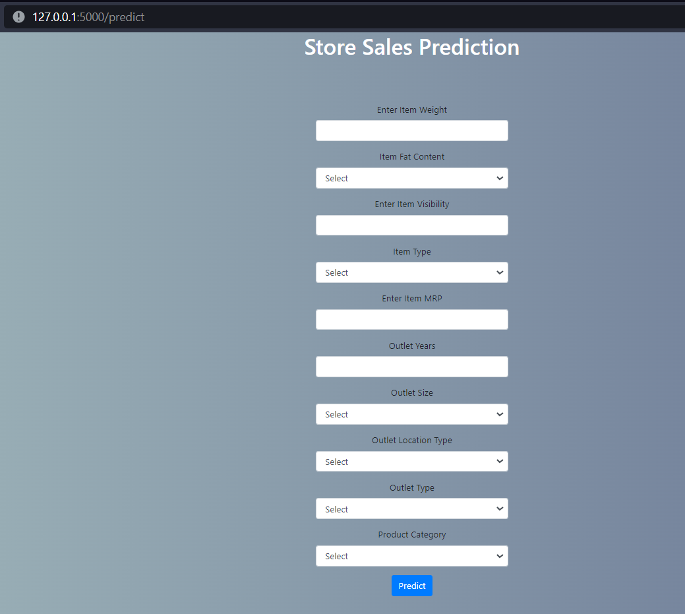
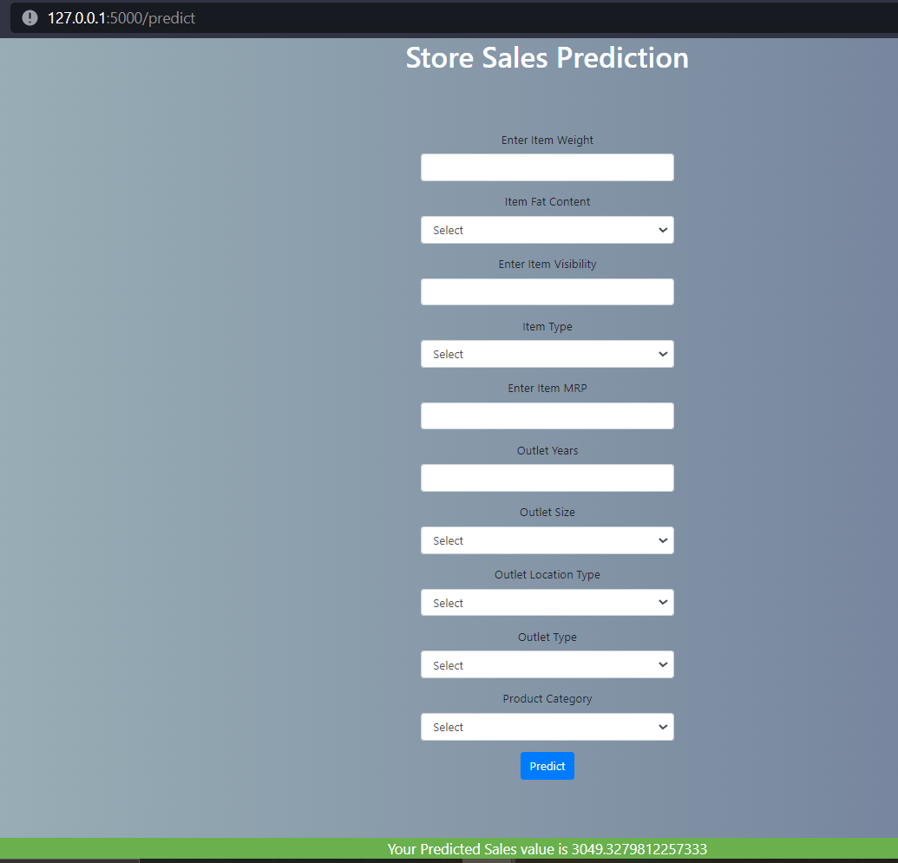

# Store Sales Prediction

## Problem Statement:

Nowadays, shopping malls and Big Marts keep track of individual item sales data in
order to forecast future client demand and adjust inventory management. In a data
warehouse, these data stores hold a significant amount of consumer information and
particular item details. By mining the data store from the data warehouse, more
anomalies and common patterns can be discovered.
## Approach:

The classical machine learning tasks like Data Exploration, Data Cleaning,
Feature Engineering, Model Building and Model Testing. Trying out different machine
learning algorithms that’s best fit for the above case.
## Results
Building a solution that should able to predict the sales of the
different stores of Big Mart according to the provided dataset.
## Dataset

We have train (8523) and test (5681) data set, train data set has both input and output
variable(s). We need to predict the sales for test data set.

| Variables | Description
| ------------- | ------------- |
|Item_Identifier| Unique product ID |
|Item_Weight| Weight of product|
|Item_Fat_Content| Whether the product is low fat or not|
|Item_Visibility| The % of total display area of all products in a store allocated to the particular product|
|Item_Type| The category to which the product belongs|
|Item_MRP| Maximum Retail Price (list price) of the product|
|Outlet_Identifier| Unique store ID|
|Outlet_Establishment_Year| The year in which store was established|
|Outlet_Size| The size of the store in terms of ground area covered|
|Outlet_Location_Type| The type of city in which the store is located|
|Outlet_Type| Whether the outlet is just a grocery store or some sort of supermarket|
|Item_Outlet_Sales| Sales of the product in the particulat store. This is the outcome variable to be predicted.|

## Data Cleaning & Preprocessing
 Raw Data Validation and Data Cleaning 

•	Data might contain Repeated/Duplicate entries, removing them.

• Data Validity check, Item Visibility has 0 as minimum value, all items need to have some visibility. 

•	Missing values imputation of the products will give better output than deleting them.

•	Outliers – Outliers can be valid or a data entry mistake, treating them with transformations to convert skewed data to normal distribution.

## Exploratory Data Analysis
•   Uni-variate analysis = Checking how each variable is distributed.

•	Bi-variate/Multi-variate analysis = how variables are related with each other and with output variable, which is Item Outlet Sales in this case.

•	Pivots – to check variables and their contribution/importance on the output variable.

•	Visualization and Data Insights – Visualizing data makes it much easier to interpret the data.

## Model Training and Testing 
•   Trained the model on Linear Regression, Ridge and Lasso Regression, and Random Forest Regressor. Best model with highest Prediction score (R Squared) and Lowest Error (Root Mean Squared Error) is selected.

## Model Evaluation
•   Predict and Evaluate the model on validation dataset.

## Hyperparameter Tuning
•   Tuning parameters to get the best score and best parameters combinations using Randomized Search Cross Validation.

## Model Building
•   Building the model with suggested parameters from Hyperparameter tuned model, testing and evaluating the model. Tuned Random Forest Regressor got highest accuracy and lowest error score. With 71.56% R Squared, and RMSE of 0.5499.

## Saving the model as pickle file
•   Model is saved in pickle format as pkl. 

## Flask Setup
•   Web application was created using Flask, which takes user inputs and passes it to the model to predict sales.

## Deployment
The cloud environment was set up and the project was deployed from GitHub into the Heroku cloud platform. 

App Link: https://ineuron-storesalesprediction.herokuapp.com/

## Webpage

## Tech Stack
**Frontend:** HTML, CSS

**Back-end:** Flask

**Deployment Server:** Heruko

**Programming Language:** Python

## Libraries and tools used

## 🔗 Links
<a href="https://github.com/suhailfazal">GitHub</a> | 
<a href="https://blog.ineuron.ai/@suhailfazaln/">Blogs</a> | 
<a href="https://www.linkedin.com/in/suhailfazal/">Linkedin</a>

[comment]: <> ([![Github]&#40;https://github.com/suhailfazal&#41;)

[comment]: <> ([![Blogs]&#40;https://blog.ineuron.ai/@suhailfazaln/&#41;)

[comment]: <> ([![linkedin]&#40;https://www.linkedin.com/in/suhailfazal/&#41;)

